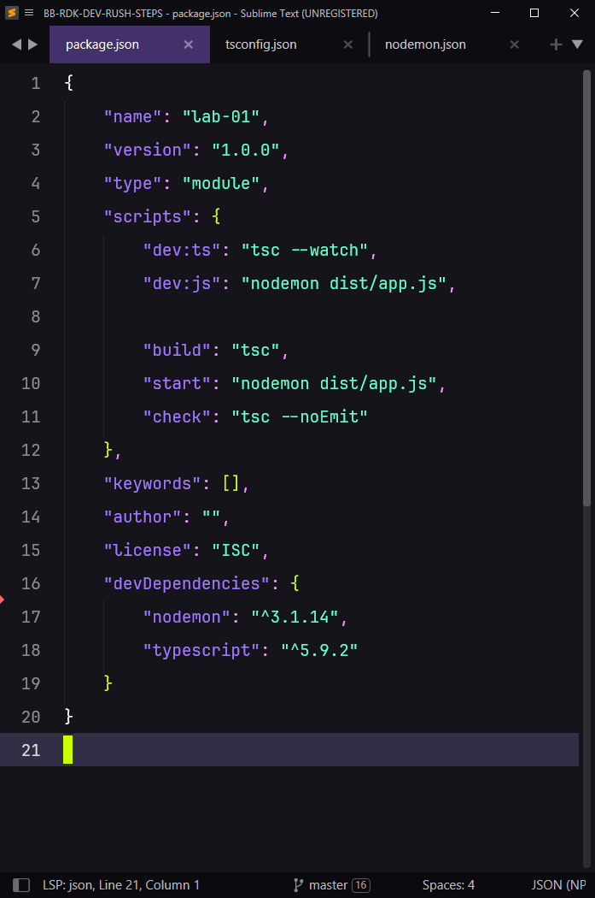
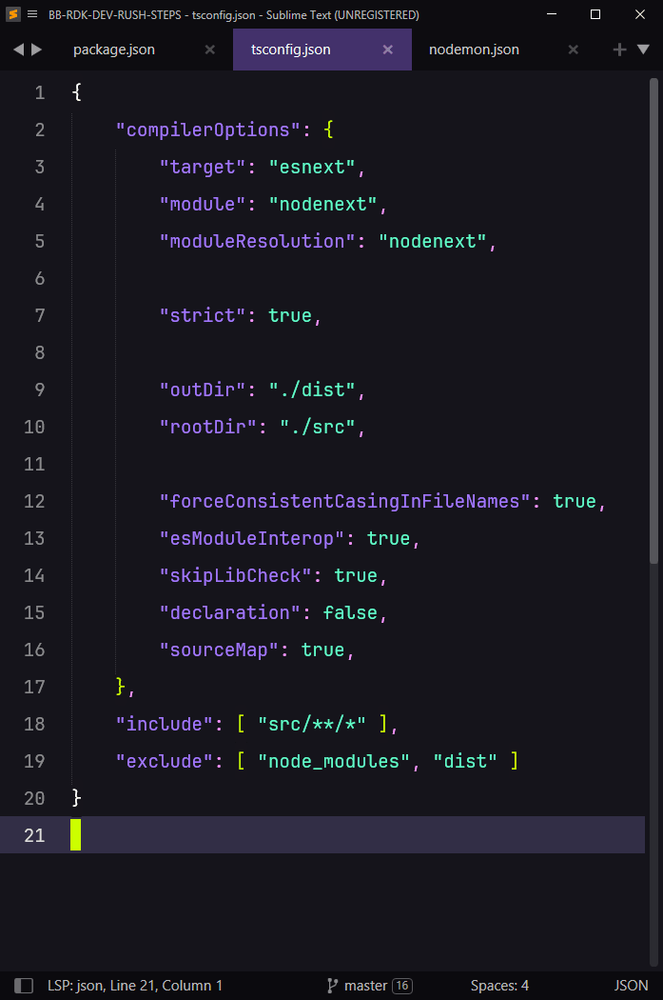
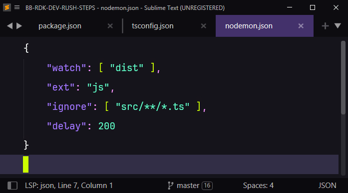
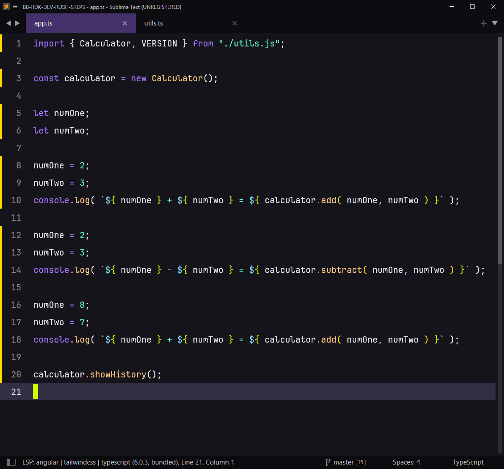
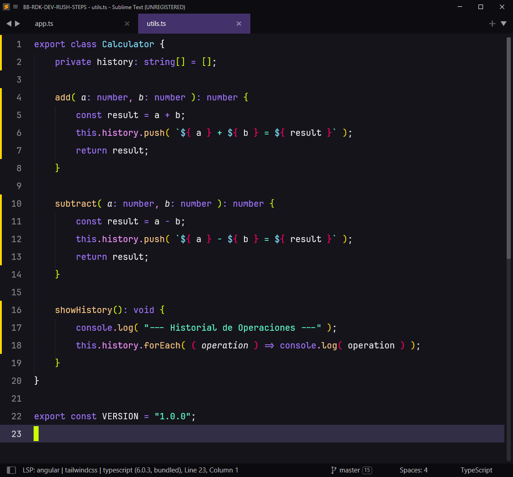

# Proyecto TypeScript #

## 01. Estructura de Carpetas ##

> [!NOTE]  
> **Archivos y Carpetas Principales del Proyecto**  
> Algunos se generan automáticamente  
> Algunos se generan manualmente  

```
📁 ts-project/
├── 📁 node_modules/
│
├── 📁 dist/
│   ├── 📄 app.js
│   └── 📄 utils.js
│
├── 📁 src/
│   ├── 📄 app.ts
│   └── 📄 utils.ts
│
├── 📄 nodemon.json
├── 📄 package-lock.json
├── 📄 package.json
└── 📄 tsconfig.json

```


--- 

## 02. Crear Proyecto ##

02.01 Terminal o Cmd  
***Git-bash/Terminal/Bash/Zsh***: (*Windows, Linux, Mac*)  
***Símbolo del Sistema***:  (*Windows*)

> [!CAUTION]
> La **versión** instalada de **Node** debe ser al menos **22.6**

`Git-bash`
```bash
$ which node
$ node -v
```

`Windows Cmd`
```bash
$ where node
$ node -v
```


02.02 Terminal o Cmd  

> [!NOTE]  
> El comando `$ npm init -y`  
> - Crea un proyecto **NodeJS**  
> - Crea el archivo **package.json**  
> - Crea el archivo **package-lock.json**  

`Comandos`  
```bash
$ mkdir ts-project
$ cd ts-project
$ npm init -y
```


02.03 Instalar dependencias

> [!CAUTION]  
> La versión requerida de **TypeScript** deber ser la **5.9.2**  

> [!NOTE]
> El comando `$ npm i `  
> - Modifica el archivo **package.json**  
> - Crea la carpeta **node_modules**  

`Comandos`  
```bash
$ npm i -D typescript@5.9.2
$ npm i -D nodemon
```

02.04 **Crear Archivos de Configuración** en la **Carpeta Raíz del Proyecto**
- package.json
- tsconfig.json
- nodemon.json

> [!NOTE]
> Se pueden crear con el comando **`$ touch`**  
> Se pueden crear desde el **Sistema Operativo**  
> Se pueden crear desde el **Editor de Código**  

02.04.01 **Checar** archivo **package.json**  
Checar que exista el archivo ***package.json***  

02.04.02 **Crear** archivo **tsconfig.json**  
Crear el archivo ***tsconfig.json***  

02.04.03 **Crear** archivo **nodemon.json**  
Crear el archivo ***nodemon.json***  


---

## 03. Configurar Proyecto ##  
03.01 Configurar archivo **package.json**  
> [!NOTE]  
> Actualiza el archivo **package.json** con las siguientes opciones  
  

03.02 Configurar archivo **tsconfig.json**  
> [!NOTE]  
> Actualiza el archivo **tsconfig.json** con las siguientes opciones  
  

03.03 Configurar archivo **nodemon.json**  
> [!NOTE]  
> Actualiza el archivo **nodemon.json** con las siguientes opciones  



---
## 04 Código Fuente ##

04.01 **Crear Archivos** en la **Carpeta Principal del Proyecto**  
> [!NOTE]  
> Se pueden crear con el comando **`$ touch`**  
> Se puede crear desde el **Sistema Operativo**  
> Se puede crear desde el **Editor de Código**  

04.01.01 Crear archivo **src/app.ts**  
04.01.02 Crear archivo **src/utils.ts**  

04.02 **Actualizar** archivo **src/app.ts**  
> [!NOTE]  
> Actualiza el archivo **src/app.ts** con las siguientes opciones  
  

04.03 **Actualizar** archivo **src/utils.ts**  
> [!NOTE]  
> Actualiza el archivo **src/utils.ts** con las siguientes opciones  
  
